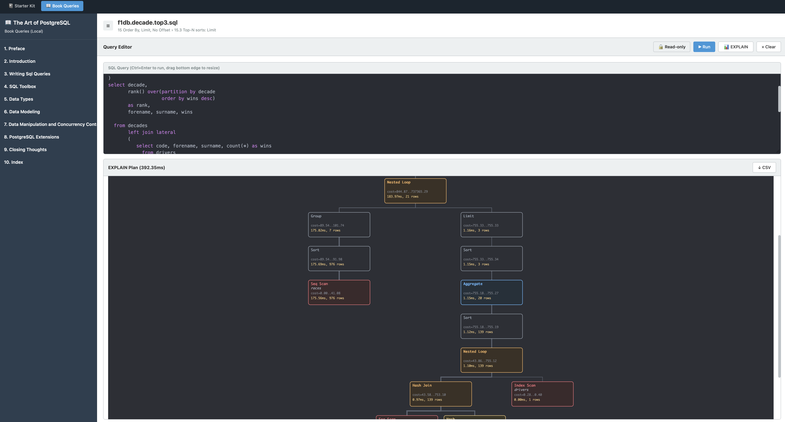
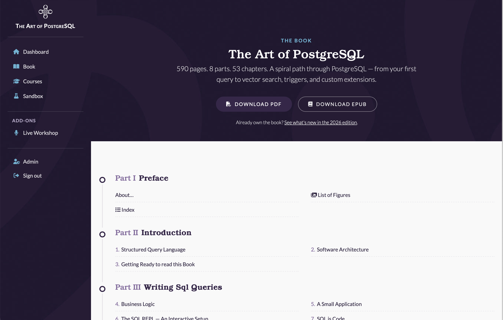

+++
title = "Introducing YeSQL: Practical PostgreSQL, One Concept at a Time"
date = "2026-08-18T10:00:00+0200"
tags = ["PostgreSQL", "SQL", "YeSQL", "Learning"]
categories = ["PostgreSQL", "YeSQL"]
icon = "📚"
+++

I'm happy to share something new: [YeSQL](https://theartofpostgresql.com/yesql/)
is live, a free set of 24 short PostgreSQL lessons — one concept, one
runnable query, real data, no signup. It's free to use today, and it's also
a prototype for something I've wanted to build for a while: making every
query in *The Art of PostgreSQL* runnable, right on the page.

<!--more-->
<!--toc-->

## Why I built it

Every SQL book has the same tension: the examples are either abstract
(`foo`, `bar`, three rows) or they're real but you have to trust the
printed output, because setting up the dataset yourself is a project in its
own right. I wanted neither. YeSQL is where I worked out how to close that
gap — each lesson pairs one idea with a query you can actually run, against
data that looks like something you'd query at work, right there on the
page.

The part I'm most pleased with is the plumbing: every runnable query on
YeSQL is powered by [PGlite](https://pglite.dev/), Postgres compiled to
WebAssembly, running directly in your browser tab. Hit **Run**, and the
query executes locally — no signup, no server round-trip, no account to
lose track of. Depending on the
lesson, the query runs against the `f1db` Formula 1 dataset, the `chinook`
music-store dataset, or a `magic` dataset built for the trickier examples —
real relational data, not three placeholder rows. Getting this widget right
across two dozen lessons and three datasets is exactly the kind of
prototyping I needed before bringing the same "run it right here" idea to
the book itself, chapter by chapter. The [app](https://theartofpostgresql.com/app/)
already does that the other way — a real, shared PostgreSQL 17 backend for
the interactive book reader — and YeSQL is where I'm working out the
client-side half of the same idea.

## What's covered

The 24 lessons are organized into six areas, following the same
progression as the book itself:

- **SQL Foundations** (9 lessons) — what a relation is, `NULL` semantics,
  `GROUP BY`, database anomalies, why Postgres.
- **Window Functions** (5 lessons) — the `OVER` clause mental model,
  `ROW_NUMBER`/`RANK`/`DENSE_RANK`, running totals, frame semantics,
  sessionization.
- **Aggregation** (3 lessons) — `FILTER`, percentiles in one query, SQL
  aggregates done right.
- **Joins & Relations** (4 lessons) — what a join actually is, join output
  cardinality, `LATERAL` joins for top-N-per-group, `WITH RECURSIVE`.
- **Performance** (3 lessons) — reading `EXPLAIN`, indexing strategy, query
  rewriting.
- **Data & Schema Design** (3 lessons) — foreign-key constraints you can
  trust, JSON and denormalized types, range types.

Each lesson stands on its own — one idea, fully explained, with a query you
can run and change — and each one closes by pointing at the book chapter it
comes from, for anyone who wants the fuller treatment: more variations, the
end-to-end use cases, and the datasets used throughout the book.

## Two lessons worth a look

A couple of examples give a better sense of the format than any
description can.

The [join lesson](https://theartofpostgresql.com/yesql/joins-and-relations/what-is-a-join/)
runs this query against the `chinook` dataset:

```sql
-- name: list-albums-by-artist
-- List the album titles and duration of a given artist
  select album.title as album,
         sum(milliseconds) * interval '1 ms' as duration
    from album
         join artist using(artist_id)
         left join track using(album_id)
   where artist.name = 'Red Hot Chili Peppers'
group by album
order by album;
```

```
┌───────────────────────┬──────────────────────────────┐
│         album         │           duration           │
├───────────────────────┼──────────────────────────────┤
│ Blood Sugar Sex Magik │ @ 1 hour 13 mins 57.073 secs │
│ By The Way            │ @ 1 hour 8 mins 49.951 secs  │
│ Californication       │ @ 56 mins 25.461 secs        │
└───────────────────────┴──────────────────────────────┘
(3 rows)
```

What makes it worth a lesson is the mental model it teaches, not the
syntax: a JOIN composes two relations into a new one that has the
properties of *both* — think composition, not overlapping Venn-diagram
circles, and `INNER`, `LEFT OUTER`, `CROSS`, and `LATERAL` all fall out of
that same idea. On the live page, that query sits in an editable code
block — change the artist name, add a `WHERE track.name ILIKE...`, hit
**Run**, and PGlite recomputes it in place, in your browser, against the
real `chinook` schema.

The [running totals lesson](https://theartofpostgresql.com/yesql/window-functions/running-totals/)
runs this one against `f1db`:

```sql
select x,
       array_agg(x) over w      as window_contents,
       round(avg(x) over w, 2)  as moving_avg

  from generate_series(1, 5) as t(x)

window w as (order by x rows between 1 preceding and current row);
```

```
 x │ window_contents │ moving_avg
═══╪═════════════════╪════════════
 1 │ {1}             │       1.00
 2 │ {1,2}           │       1.50
 3 │ {2,3}           │       2.50
 4 │ {3,4}           │       3.50
 5 │ {4,5}           │       4.50
(5 rows)
```

`array_agg(x) over w` is the trick worth remembering: it shows you the
*exact contents* of the sliding frame for every row, so `ROWS BETWEEN 1
PRECEDING AND CURRENT ROW` stops being an abstract phrase and becomes
something you can see move down the result set. It's editable the same
way — swap in `2 preceding` or point it at a real F1 lap-times column
instead of `generate_series`, and watch the window contents change
live.

## Good company

YeSQL joins a genuinely good set of resources for learning SQL online, and
each one is doing something distinct that's worth knowing about.

[PGExercises](https://pgexercises.com/) has been the reference for
learn-by-doing SQL for over a decade: one consistent dataset (a fictional
country club), a long, well-sequenced problem set from basic `SELECT`
through joins, aggregation, and recursive queries, released under CC
BY-SA. It's exercise-first — you get a question and a schema, and you write
the query — which is a great complement to YeSQL's concept-first lessons.
If pgexercises is where you test what you know, YeSQL is a good place to
pick up the parts you haven't met yet, especially in window functions and
schema design, where it goes further than most exercise sets.

There's a similarly lovely new wave of tutorials built the same way YeSQL
is, on PGlite. [Learn PSG](https://www.learnpsg.com/) offers 20 five-minute
lessons for complete beginners, split between core SQL and pgvector.
[PSQLab](https://dev.to/neetigyachahar/introducing-psqlab-your-in-browser-postgresql-playground-4anb)
wraps the same engine in a Jupyter-notebook-style interface, and
[Codapi's Postgres playground](https://codapi.org/postgres-pglite/) turns
it into an embeddable widget for docs and courses everywhere. It's a great
sign for the ecosystem that PGlite has matured to the point where several
of us reached for it independently to solve the same "let people actually
run the query" problem.

## Run a real Postgres server locally, with a query UI and EXPLAIN diagrams

YeSQL's browser-side PGlite datasets are a great way to try a lesson in
thirty seconds, but they're a taste, not the whole meal. For the full
datasets, the full schema, and read-write access, there's
[the Lab](https://github.com/dimitri/TheArtOfPostgreSQL) — the free, public
repository behind the book, with every SQL query organized by chapter, the
Open Source datasets used throughout, and a `docker compose up` away from a
real local PostgreSQL instance with a query UI that renders `EXPLAIN`
plans, and even PostGIS results, right in the browser. It's the same spirit
as YeSQL — free, no signup, run it yourself — just with more room to
experiment.

<figure class="zoomable-figure">
  
  <figcaption style="font-size:.85rem; opacity:.75; margin-top:6px;">The Lab's query UI showing a SQL query and its EXPLAIN plan side by side. Click to zoom.</figcaption>
</figure>

## Try the free sample experience

YeSQL is the free front door — the same "run it live, no signup" spirit
carries through to [the free sample of the app](https://theartofpostgresql.com/app/):
a curated selection of chapters and lessons from *The Art of PostgreSQL*,
with the full interactive book reader, connected live to a real PostgreSQL
17 database, no credit card and no install required. It's the best way to
see where this is headed: [YeSQL](https://theartofpostgresql.com/yesql/)
today, the full interactive book tomorrow.

<figure class="zoomable-figure">
  
  <figcaption style="font-size:.85rem; opacity:.75; margin-top:6px;">The companion app's dashboard, showing the interactive book reader's table of contents. Click to zoom.</figcaption>
</figure>

Start with the 24 free lessons at
[theartofpostgresql.com/yesql](https://theartofpostgresql.com/yesql/), then
[create a free account](https://theartofpostgresql.com/app/) to try the
sample chapters and see the rest of the app.

<div id="zoom-overlay" style="display:none; position:fixed; inset:0; z-index:9999; background:rgba(20,14,28,0.85); cursor: zoom-out; align-items:center; justify-content:center; padding: 24px;">
  
</div>
<script>
(function () {
  var overlay = document.getElementById('zoom-overlay');
  var overlayImg = document.getElementById('zoom-overlay-img');
  document.querySelectorAll('.zoomable-figure img').forEach(function (img) {
    img.addEventListener('click', function () {
      overlayImg.src = img.getAttribute('src');
      overlayImg.alt = img.getAttribute('alt') || '';
      overlay.style.display = 'flex';
    });
  });
  overlay.addEventListener('click', function () {
    overlay.style.display = 'none';
    overlayImg.src = '';
  });
  document.addEventListener('keydown', function (e) {
    if (e.key === 'Escape') {
      overlay.style.display = 'none';
      overlayImg.src = '';
    }
  });
})();
</script>
